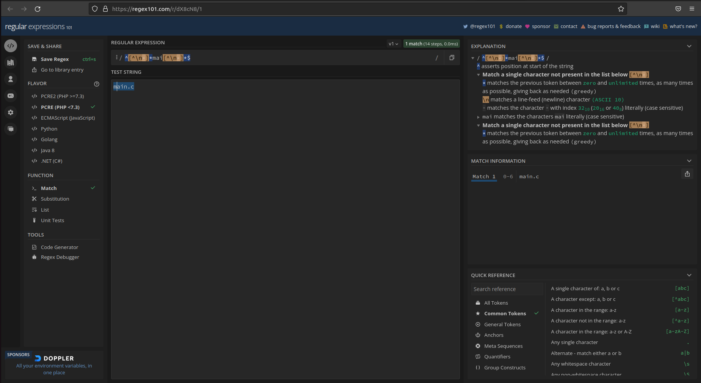
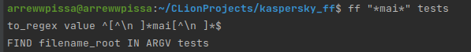
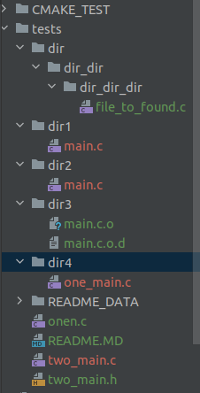
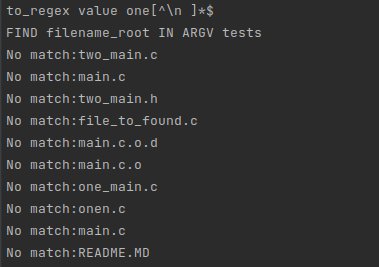

#  Testing 
We are in WorkDir of script.sh
```console
foo@bar:~$ ff main.c tests
tests/two_main.c
tests/dir1/main.c
tests/one_not_main.c
tests/dir2/main.c
tests/one_main.c
```
```console
foo@bar:~$ ff "main.c" tests
tests/dir1/main.c
tests/dir2/main.c
```
> Note: `""` is required for use with ?/* rendering.
```console
foo@bar:~$ ff "main*" tests
tests/two_main.c
tests/dir1/main.c
tests/two_main.h
tests/dir3/main.c.o.d
tests/dir3/main.c.o
tests/one_not_main.c
tests/dir2/main.c
tests/one_main.c
```
```console
foo@bar:~$ ff "main?" tests
```

## Bugs
Wrong code response with *. 
_Wrong interpretation of POSIX regexp standarts_ 
# posix format
https://regex101.com/r/ZcjCpD/1
 

# MyQuery
(Debug mode)

 returns nothing
# MyFiles


# Bug

```console
foo@bar:~$ ff "one*" tests
```
regex says:



Also Tried with ^ top, also nothing